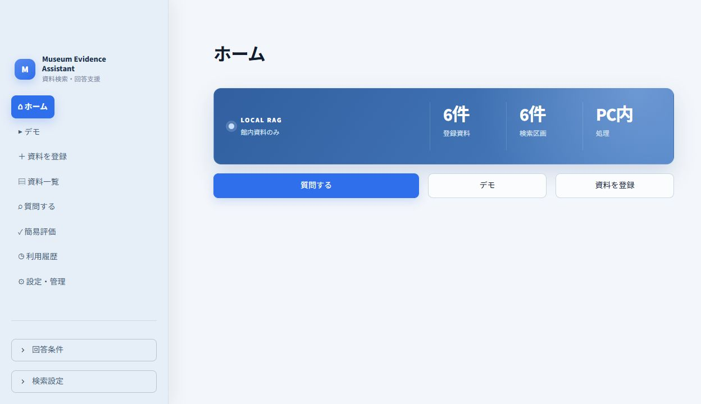
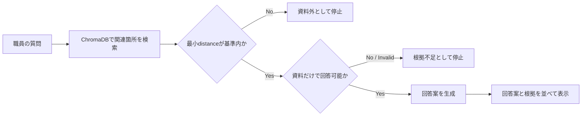

# Museum Evidence Assistant — 科学館職員向けローカルRAG

[](https://github.com/yutoo77/museum-evidence-assistant/actions/workflows/ci.yml)

科学館内に分散する展示解説・FAQ・案内資料を検索し、**登録資料だけに基づく回答案と根拠**を職員が確認するためのlocal-first RAG prototypeです。

> A local-first, evidence-grounded RAG prototype for science museum staff.



`sample_docs/`の施設名、開館時間、利用規則、展示解説はすべて架空です。実在する科学館の公式情報や研究内部資料は含みません。

## このRepositoryで見てほしいこと

1. **Privacy boundaryをcodeで固定** — 文書本文と質問を外部APIへ送らず、Ollama接続先とWeb UIをloopbackへ限定しています。
2. **「答える」より「根拠がなければ止まる」を優先** — vector distanceとLLMによる回答可能性判定を分け、資料外・根拠不足の2種類を扱います。
3. **動作確認と研究評価を混同しない** — unit test、UI smoke test、隔離Benchmark runnerを用意し、9問の結果は汎化性能ではなくsmoke testだと明記しています。

## 解決したい課題

科学館では、展示解説、職員向けFAQ、イベント資料などが複数のfileへ分散しやすく、必要な情報を探して説明へ利用するまでに時間がかかります。一方、一般的な生成AIへ館内資料を送ることや、根拠のない回答を来館者案内へ使うことにはリスクがあります。

Museum Evidence Assistantは次の範囲へ問題を絞っています。

- 職員がPDF・txt・mdをlocal PCへ登録する
- 質問に関連する箇所を検索する
- 資料だけで回答できる場合に限り、職員確認用の回答案を作る
- 資料名・page・該当箇所を並べ、回答と根拠を照合できるようにする
- 根拠が弱い場合は、無理に回答しない

来館者が直接利用するchatbotではなく、**職員の確認を前提としたdecision-support tool**です。

## 主な機能

| 機能 | 内容 |
|---|---|
| 資料登録 | PDF・txt・md、50MB上限、内容hashによる重複防止、同名資料のversion更新 |
| Local retrieval | `embeddinggemma`、ChromaDB、cosine distance、登録中versionだけを検索 |
| 回答抑制 | distance gateと`qwen3:1.7b`によるYES／NOの回答可能性gate |
| 根拠提示 | 資料名、page、chunk、distance、該当本文を表示 |
| 表現調整 | 来館者、説明場面、回答言語を選択 |
| Demo | 架空資料の一括登録、model warm-up、3つの代表scenario |
| 評価 | 3分類9問の簡易評価、CSV出力、再現可能な隔離Benchmark CLI |
| 履歴 | 質問・回答・判定・根拠識別情報・職員feedbackをJSONLへ保存 |

## 回答を止める設計



資料外質問と、話題は近いものの資料だけでは答えられない質問を分けています。小型LLMの判定だけに依存せず、検索段階のdistance gateを先に置いて不要な生成を抑えます。

## System architecture


大きなAgent frameworkやLangChainは使用せず、document loading、chunking、retrieval、generation、storage、UIを小さなPython moduleへ分けています。これにより、Ollamaを使わないunit testではFake実装へ差し替えられます。

## 技術選定

| 技術 | 用途 | 選定理由 |
|---|---|---|
| Python 3.11 | Application logic | 科学・AI周辺libraryと型付きdomain modelを扱いやすい |
| Streamlit | 職員向けUI | 研究prototypeを短期間で操作可能な形にしやすい |
| Ollama | Local LLM / embedding | 文書本文と質問を外部APIへ送らないboundaryを作れる |
| ChromaDB | Vector store | 小規模な単一PC環境でembeddingとmetadataを永続化できる |
| SQLite | 資料台帳 | version、hash、原本pathをtransaction付きで管理できる |
| PyMuPDF | PDF text extraction | page番号を保持したtext抽出ができる |
| HTTPX | Ollama client | framework固有の抽象化を増やさずAPI contractを明示できる |
| pytest / Ruff | Test / lint | Local AIなしで回帰確認し、CIでも同じ品質gateを使える |

## Directory structure

```text
.
├── app.py                     # Streamlit entry point
├── src/
│   ├── benchmark/             # Dataset loader, metrics, runner, report, CLI
│   ├── ui/                    # PageごとのUI
│   ├── document_service.py    # 登録transaction
│   ├── qa_service.py          # Retrieval → gate → generation
│   ├── retrieval.py           # 検索とdistance判定
│   └── runtime.py             # Dependency composition
├── benchmarks/rag_v1/         # 公開可能なsmoke datasetと初回結果
├── sample_docs/               # 架空のdemo資料
├── tests/                     # Unit / UI smoke / explicit integration test
├── data/                      # 実行時data。中身はGit管理外
├── start_app.cmd              # Windows向けlauncher
├── config.yaml                # Model・chunk・retrieval設定
└── SECURITY.md                # Threat modelと既知risk
```

## 必要環境

- Python 3.11（64bit）
- [Ollama](https://ollama.com/)
- Modelとdependency用に数GB以上の空き容量

Windows 10／11で実機確認しています。Application codeはmacOS／Linuxでも起動可能な構成ですが、`start_app.cmd`と`start_app.ps1`はWindows専用です。CIではWindowsとUbuntuの両方で、Ollamaを使わないtestを実行します。

## Quick start

### 1. Cloneとvirtual environment

```powershell
git clone https://github.com/yutoo77/museum-evidence-assistant.git
cd museum-evidence-assistant
py -3.11 -m venv .venv
.\.venv\Scripts\Activate.ps1
python -m pip install --upgrade pip
python -m pip install -r requirements.txt
```

macOS／Linuxでは、Python 3.11でvirtual environmentを作成し、`source .venv/bin/activate`を使用してください。

### 2. Local model

Ollamaを起動してから、modelを取得します。

```powershell
ollama pull embeddinggemma
ollama pull qwen3:1.7b
ollama list
```

Model取得時だけInternet接続が必要です。Application実行時の既定接続先は`http://127.0.0.1:11434`です。

### 3. 起動

Windowsでは`start_app.cmd`をdouble-clickできます。Python、Ollama、必要modelを確認してから、`http://127.0.0.1:8501`を開きます。

Terminalから起動する場合：

```powershell
python -m streamlit run app.py
```

## 3分Demo

1. Sidebarの「デモ」を開く
2. 「デモ資料を準備」を押す
3. 「回答モデルを準備」を押す
4. `回答できる` scenarioで、回答案と`moon_phase.txt`の根拠を確認する
5. `関連度で停止` scenarioで、無関係な質問に回答しないことを示す
6. `根拠不足で停止` scenarioで、関連資料があっても答えがない場合に停止することを示す

初回model loadは時間がかかるため、発表前にwarm-upしてください。

## Testと品質確認

Development dependencyを導入します。

```powershell
python -m pip install -r requirements-dev.txt
```

Local verification：

```powershell
python -m ruff check app.py src tests
python -m pytest
python -m compileall app.py src tests
```

通常のtestはOllamaを必要としません。Embedding → Chromaの明示的なintegration testだけ、次の環境変数で有効化します。

```powershell
$env:RUN_OLLAMA_INTEGRATION = "1"
python -m pytest tests/test_ollama_integration.py -v
Remove-Item Env:RUN_OLLAMA_INTEGRATION
```

GitHub Actionsではpush／pull requestごとにWindows・Ubuntuでlint、59件の通常test、compile checkを行います。Ollama integrationはlocalで明示実行します。

## RAG smoke benchmark

`benchmarks/rag_v1/`には、架空資料だけを使うschema付き9問datasetがあります。通常Applicationの`data/`から隔離した状態で実行できます。

```powershell
python -m src.benchmark.cli --run-id smoke-local-01
```

結果はGit管理外の`outputs/benchmarks/smoke-local-01/`へ保存されます。

2026-08-11の初回local run：

| Metric | Result |
|---|---:|
| Expected status | 9 / 9 |
| False answer rate | 0.0 |
| False refusal rate | 0.0 |
| Retrieval Hit@5 | 1.0 |
| MRR@5 | 1.0 |
| Median latency | 10.783 sec |
| p95 latency | 68.3506 sec |

この9問は同じdemo資料とthreshold調整に使用済みの`smoke` splitです。**研究上の精度や未知dataへの汎化性能を示しません。** 結果の意味、dataset schema、再現条件は[`benchmarks/rag_v1/README.md`](benchmarks/rag_v1/README.md)を参照してください。

## Dataとprivacy

Applicationは原本、vector、資料台帳、質問、回答案、根拠識別情報をlocalの`data/`へ保存します。Interaction logは根拠本文全体を保存しませんが、質問と回答案は保存します。

`data/`、`outputs/`、`.streamlit/secrets.toml`、`.env`はGit管理外です。実資料を登録した作業copyを共有する前には、必ず未追跡fileも確認してください。詳細は[`SECURITY.md`](SECURITY.md)に記載しています。

## 設計上のtrade-off

| 判断 | 得られるもの | 制約 |
|---|---|---|
| 完全local実行 | 文書を外部APIへ送らない | 初回model取得、PC性能、長いlatency |
| 小型LLM | 一般PCで動かしやすい | 判定・表現の不安定さ |
| 2段階gate | 資料外回答を抑えやすい | False refusalと追加latency |
| Streamlit | 研究demoを短期間で構築 | Multi-user、細かなFrontend制御には不向き |
| Frameworkを薄くする | 処理境界とtest対象が明確 | Agent機能は自前で設計する必要がある |

## 現在の制約

- 画像のみのPDFはOCR未対応
- PDFの段組み、縦書き、表は抽出順が崩れる場合がある
- distance thresholdは資料集合ごとの校正が必要
- 生成回答のclaim単位support判定は未実装
- Prompt injectionを含む悪意ある文書は想定していない
- Authenticationと職員ごとの権限管理は未実装
- 単一PC・小規模demo向けで、複数人同時利用は未評価
- 回答案は科学館の公式見解や職員確認を代替しない

## 今後の改善候補

優先順位は、機能数より評価可能性と安全性を上に置いています。

1. 未調整corpusによる`dev`／locked `test` datasetの作成
2. Claim単位の根拠support評価
3. Retrieval、gate、generation別のlatency計測
4. OCRと複雑なPDF layoutへの対応
5. Rule baselineとbounded Agentの比較
6. Voice UIは、Text baselineと評価設計が固まった後に別段階で検討

## License

このRepositoryは[GNU Affero General Public License v3.0](LICENSE)で公開します。主要dependencyのlicenseと注意事項は[`THIRD_PARTY_NOTICES.md`](THIRD_PARTY_NOTICES.md)を参照してください。

## Author

[yutoo77](https://github.com/yutoo77) — graduate research prototype / portfolio project
