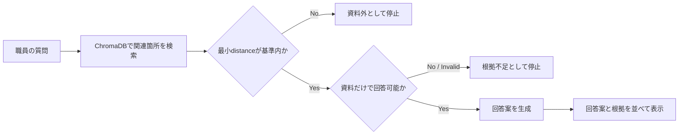
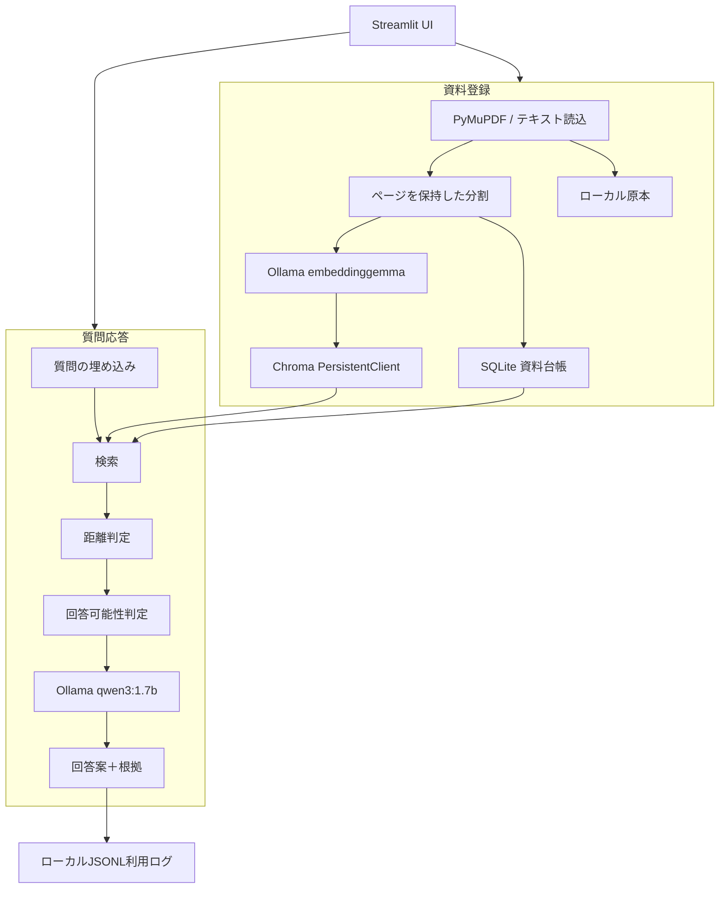

# Museum Evidence Assistant — 科学館職員向けローカルRAG

[](https://github.com/yutoo77/museum-evidence-assistant/actions/workflows/ci.yml)

科学館内に分散する展示解説・FAQ・案内資料を検索し、**登録資料だけに基づく回答案と根拠**を職員が確認するための、ローカル完結型RAGプロトタイプです。

> A local-first, evidence-grounded RAG prototype for science museum staff.


`sample_docs/`の施設名、開館時間、利用規則、展示解説はすべて架空です。実在する科学館の公式情報や、研究用の内部資料は含みません。

## このリポジトリの見どころ

1. **プライバシー境界をコードで固定** — 文書本文と質問を外部APIへ送らず、Ollamaの接続先とWeb UIをループバックアドレスへ限定しています。
2. **「答える」より「根拠がなければ止まる」を優先** — ベクトル距離とLLMによる回答可能性判定を分け、資料外・根拠不足の2種類を扱います。
3. **動作確認と研究評価を混同しない** — 単体テスト、UIスモークテスト、隔離されたベンチマーク実行基盤を用意し、9問の結果は汎化性能ではなく動作確認だと明記しています。

## 解決したい課題

科学館では、展示解説、職員向けFAQ、イベント資料などが複数のファイルへ分散しやすく、必要な情報を探して説明へ利用するまでに時間がかかります。一方、一般的な生成AIへ館内資料を送ることや、根拠のない回答を来館者案内へ使うことにはリスクがあります。

Museum Evidence Assistantは次の範囲へ問題を絞っています。

- 職員がPDF・TXT・MarkdownをローカルPCへ登録する
- 質問に関連する箇所を検索する
- 資料だけで回答できる場合に限り、職員確認用の回答案を作る
- 資料名・ページ・該当箇所を並べ、回答と根拠を照合できるようにする
- 根拠が弱い場合は、無理に回答しない

来館者が直接利用するチャットボットではなく、**職員の確認を前提とした意思決定支援ツール**です。

## 主な機能

| 機能 | 内容 |
|---|---|
| 資料登録 | PDF・TXT・Markdown、50MB上限、内容ハッシュによる重複防止、同名資料の版管理 |
| ローカル検索 | `embeddinggemma`、ChromaDB、コサイン距離、登録中の版だけを検索 |
| 回答抑制 | 距離判定と`qwen3:1.7b`によるYES／NOの回答可能性判定 |
| 根拠提示 | 資料名、ページ、チャンク、距離、該当本文を表示 |
| 表現調整 | 来館者、説明場面、回答言語を選択 |
| デモ | 架空資料の一括登録、モデルの事前読み込み、3つの代表シナリオ |
| 評価 | 3分類9問の簡易評価、CSV出力、再現可能な隔離ベンチマークCLI |
| 履歴 | 質問・回答・判定・根拠識別情報・職員フィードバックをJSONLへ保存 |

## 回答を止める設計



資料外質問と、話題は近いものの資料だけでは答えられない質問を分けています。小型LLMの判定だけに依存せず、検索段階の距離判定を先に置いて不要な生成を抑えます。

## システム構成



大規模なエージェントフレームワークやLangChainは使用せず、文書読み込み、分割、検索、生成、保存、UIを小さなPythonモジュールへ分けています。これにより、Ollamaを使わない単体テストではテスト用実装へ差し替えられます。

## 技術選定

| 技術 | 用途 | 選定理由 |
|---|---|---|
| Python 3.11 | アプリケーションロジック | 科学・AI周辺のライブラリと型付きドメインモデルを扱いやすい |
| Streamlit | 職員向けUI | 研究プロトタイプを短期間で操作可能な形にしやすい |
| Ollama | ローカルLLM・埋め込み | 文書本文と質問を外部APIへ送らない実行境界を作れる |
| ChromaDB | ベクトルストア | 小規模な単一PC環境で埋め込みとメタデータを永続化できる |
| SQLite | 資料台帳 | 版、ハッシュ、原本パスをトランザクション付きで管理できる |
| PyMuPDF | PDFテキスト抽出 | ページ番号を保持したテキスト抽出ができる |
| HTTPX | Ollamaクライアント | フレームワーク固有の抽象化を増やさずAPI仕様を明示できる |
| pytest / Ruff | テスト・静的解析 | ローカルAIなしで回帰確認し、CIでも同じ品質基準を使える |

## ディレクトリ構成

```text
.
├── app.py                     # Streamlitの起点
├── src/
│   ├── benchmark/             # データ読込、指標、実行、レポート、CLI
│   ├── ui/                    # ページごとのUI
│   ├── document_service.py    # 資料登録処理
│   ├── qa_service.py          # 検索 → 判定 → 生成
│   ├── retrieval.py           # 検索と距離判定
│   └── runtime.py             # 依存関係の組み立て
├── benchmarks/rag_v1/         # 公開可能なスモークデータと初回結果
├── sample_docs/               # 架空のデモ資料
├── tests/                     # 単体・UIスモーク・明示的な統合テスト
├── data/                      # 実行時データ。中身はGit管理外
├── start_app.cmd              # Windows向け起動ファイル
├── config.yaml                # モデル・分割・検索設定
└── SECURITY.md                # 脅威モデルと既知のリスク
```

## 必要環境

- Python 3.11（64bit）
- [Ollama](https://ollama.com/)
- モデルと依存パッケージ用に数GB以上の空き容量

Windows 10／11で実機確認しています。アプリ本体はmacOS／Linuxでも起動可能な構成ですが、`start_app.cmd`と`start_app.ps1`はWindows専用です。CIではWindowsとUbuntuの両方で、Ollamaを使わないテストを実行します。

## セットアップ

### 1. クローンと仮想環境

```powershell
git clone https://github.com/yutoo77/museum-evidence-assistant.git
cd museum-evidence-assistant
py -3.11 -m venv .venv
.\.venv\Scripts\Activate.ps1
python -m pip install --upgrade pip
python -m pip install -r requirements.txt
```

macOS／Linuxでは、Python 3.11で仮想環境を作成し、`source .venv/bin/activate`を使用してください。

### 2. ローカルモデル

Ollamaを起動してから、モデルを取得します。

```powershell
ollama pull embeddinggemma
ollama pull qwen3:1.7b
ollama list
```

モデル取得時だけインターネット接続が必要です。アプリ実行時の既定接続先は`http://127.0.0.1:11434`です。

### 3. 起動

Windowsでは`start_app.cmd`をダブルクリックできます。Python、Ollama、必要なモデルを確認してから、`http://127.0.0.1:8501`を開きます。

ターミナルから起動する場合：

```powershell
python -m streamlit run app.py
```

## 3分デモ

1. サイドバーの「デモ」を開く
2. 「デモ資料を準備」を押す
3. 「回答モデルを準備」を押す
4. `回答できる`シナリオで、回答案と`moon_phase.txt`の根拠を確認する
5. `関連度で停止`シナリオで、無関係な質問に回答しないことを示す
6. `根拠不足で停止`シナリオで、関連資料があっても答えがない場合に停止することを示す

初回のモデル読み込みには時間がかかるため、発表前にウォームアップしてください。

## テストと品質確認

開発用の依存パッケージを導入します。

```powershell
python -m pip install -r requirements-dev.txt
```

ローカルでの確認：

```powershell
python -m ruff check app.py src tests
python -m pytest
python -m compileall app.py src tests
```

通常のテストはOllamaを必要としません。埋め込み生成からChromaDBへの保存までを確認する統合テストだけ、次の環境変数で有効化します。

```powershell
$env:RUN_OLLAMA_INTEGRATION = "1"
python -m pytest tests/test_ollama_integration.py -v
Remove-Item Env:RUN_OLLAMA_INTEGRATION
```

GitHub Actionsでは、push／pull requestごとにWindows・Ubuntuで静的解析、59件の通常テスト、構文確認を行います。Ollama統合テストはローカルで明示的に実行します。

## RAGスモークベンチマーク

`benchmarks/rag_v1/`には、架空資料だけを使うスキーマ付き9問データセットがあります。通常のアプリが使用する`data/`から隔離した状態で実行できます。

```powershell
python -m src.benchmark.cli --run-id smoke-local-01
```

結果はGit管理外の`outputs/benchmarks/smoke-local-01/`へ保存されます。

2026-08-11の初回ローカル実行：

| 指標 | 結果 |
|---|---:|
| 期待状態の一致 | 9 / 9 |
| 誤回答率 | 0.0 |
| 誤拒否率 | 0.0 |
| Retrieval Hit@5 | 1.0 |
| MRR@5 | 1.0 |
| 応答時間中央値 | 10.783秒 |
| 応答時間p95 | 68.3506秒 |

この9問は同じデモ資料としきい値調整に使用済みの`smoke`分割です。**研究上の精度や未知データへの汎化性能を示しません。** 結果の意味、データセットのスキーマ、再現条件は[`benchmarks/rag_v1/README.md`](benchmarks/rag_v1/README.md)を参照してください。

## データとプライバシー

アプリは原本、ベクトルデータ、資料台帳、質問、回答案、根拠識別情報をローカルの`data/`へ保存します。利用ログは根拠本文全体を保存しませんが、質問と回答案は保存します。

`data/`、`outputs/`、`.streamlit/secrets.toml`、`.env`はGit管理外です。実資料を登録した作業コピーを共有する前には、必ず未追跡ファイルも確認してください。詳細は[`SECURITY.md`](SECURITY.md)に記載しています。

## 設計上のトレードオフ

| 判断 | 得られるもの | 制約 |
|---|---|---|
| 完全ローカル実行 | 文書を外部APIへ送らない | 初回モデル取得、PC性能、長い応答時間 |
| 小型LLM | 一般PCで動かしやすい | 判定・表現の不安定さ |
| 2段階判定 | 資料外回答を抑えやすい | 誤拒否と追加の応答時間 |
| Streamlit | 研究デモを短期間で構築 | 複数人利用、細かな画面制御には不向き |
| フレームワークを薄くする | 処理境界とテスト対象が明確 | エージェント機能は自前で設計する必要がある |

## 現在の制約

- 画像のみのPDFはOCR未対応
- PDFの段組み、縦書き、表は抽出順が崩れる場合がある
- 距離のしきい値は資料集合ごとの校正が必要
- 生成回答の主張単位の根拠整合性判定は未実装
- プロンプトインジェクションを含む悪意ある文書は想定していない
- 認証と職員ごとの権限管理は未実装
- 単一PC・小規模デモ向けで、複数人同時利用は未評価
- 回答案は科学館の公式見解や職員確認を代替しない

## 今後の改善候補

優先順位は、機能数より評価可能性と安全性を上に置いています。

1. 未調整の資料集合による`dev`／固定`test`データセットの作成
2. 主張単位の根拠整合性評価
3. 検索、判定、生成ごとの応答時間計測
4. OCRと複雑なPDFレイアウトへの対応
5. ルールベースラインと限定的エージェントの比較
6. 音声UIは、テキスト版の基準システムと評価設計が固まった後に別段階で検討

## ライセンス

このリポジトリは[GNU Affero General Public License v3.0](LICENSE)で公開します。主要な依存ライブラリのライセンスと注意事項は[`THIRD_PARTY_NOTICES.md`](THIRD_PARTY_NOTICES.md)を参照してください。

## 作成者

[yutoo77](https://github.com/yutoo77) — 大学院研究プロトタイプ／技術ポートフォリオ
